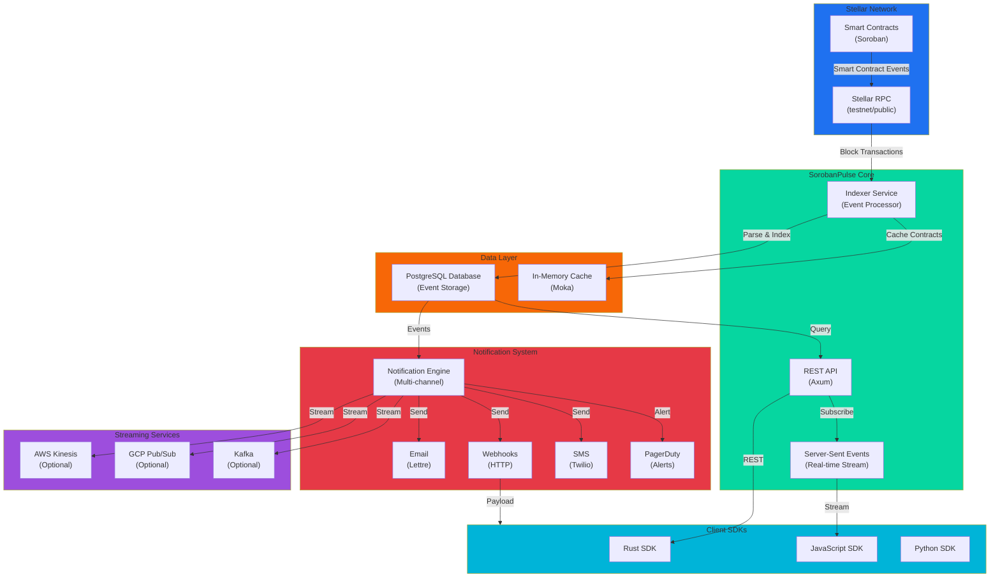
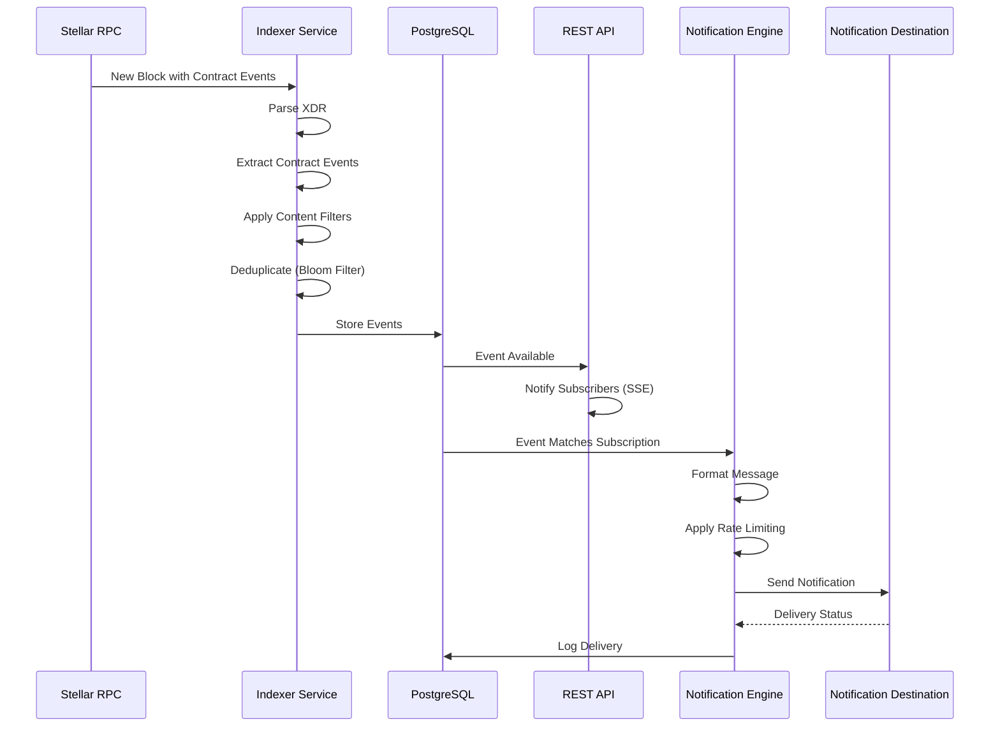
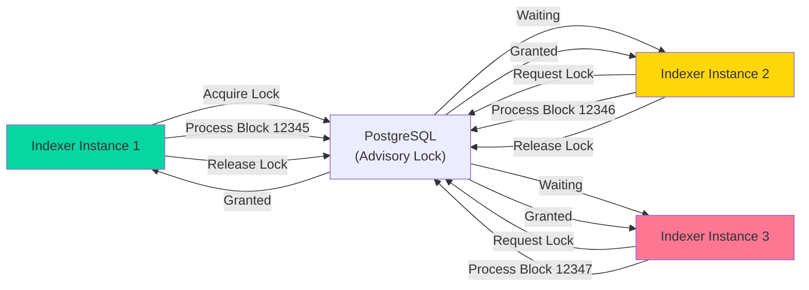
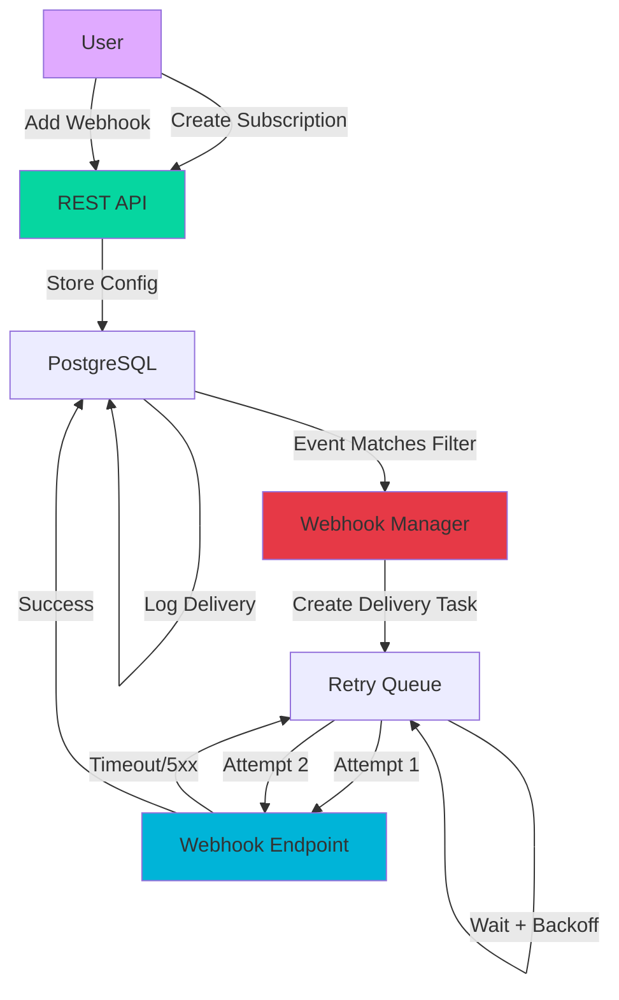
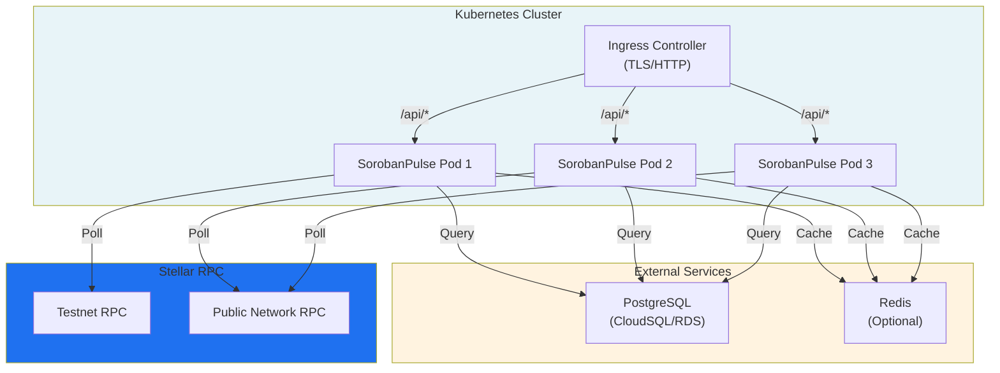
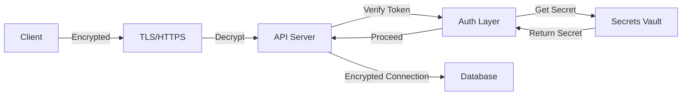

# SorobanPulse Architecture

This document provides a comprehensive overview of the SorobanPulse system architecture, including component interactions, data flow, and integration patterns.

## System Architecture Overview

SorobanPulse is a high-performance event indexing and notification system for the Stellar blockchain. It monitors smart contract events through the Stellar RPC, indexes them into a PostgreSQL database, and delivers real-time notifications to subscribers via multiple channels.

## Component Descriptions

### Stellar Integration Layer

**Stellar RPC**
- Connects to Stellar's RPC endpoints (testnet or public network)
- Fetches ledgers and transactions containing smart contract events
- Provides XDR-encoded contract invocation data

### Indexer Service

The Indexer is the heart of SorobanPulse, responsible for:

1. **Event Polling**: Continuously polls Stellar RPC for new blocks
2. **XDR Parsing**: Parses XDR-encoded contract invocation data
3. **Event Extraction**: Extracts contract events and their parameters
4. **Deduplication**: Uses Bloom filters to prevent processing duplicate events
5. **Content Filtering**: Applies user-defined filters to events
6. **Transformation**: Applies Lua transformations for custom processing
7. **Storage**: Persists events to PostgreSQL

### API Layer

The REST API provides:
- Event querying with pagination and filtering
- Subscription management
- Webhook configuration
- Real-time SSE streaming
- Administrative endpoints

**Key Technologies**:
- **Framework**: Axum web framework
- **Database**: SQLx for type-safe queries
- **Validation**: OpenAPI/Swagger documentation

### Data Layer

**PostgreSQL Database**
- Stores indexed events
- Maintains subscription and webhook metadata
- Stores notification delivery logs
- Supports full-text search and complex queries

**In-Memory Cache (Moka)**
- Caches smart contract metadata
- Reduces database load for frequently accessed contracts
- Configurable TTL for cache invalidation

### Notification System

Multi-channel notification delivery with:

1. **Email Notifications** (Lettre)
   - SMTP integration with DKIM signing
   - SPF/DKIM/DMARC validation
   - HTML and plain-text templates
   - Multi-language support (Handlebars)

2. **Webhooks**
   - HTTP POST delivery with retry logic
   - HMAC signature verification
   - Custom headers and payload transformation
   - Rate limiting per webhook

3. **SMS Notifications** (Twilio)
   - Short-form messages for critical alerts
   - Character limit optimization

4. **PagerDuty Integration**
   - Incident creation for critical events
   - On-call escalation support

5. **Streaming Services**
   - AWS Kinesis for high-throughput streaming
   - GCP Pub/Sub for multi-region delivery
   - Kafka for self-hosted deployments

## Event Flow

## Multi-Replica Advisory Lock Mechanism

For systems with multiple SorobanPulse instances, advisory locks prevent duplicate event processing:

**How It Works**:
1. Each indexer attempts to acquire an exclusive lock on a block sequence number
2. Only one instance can hold the lock at a time
3. The lock holder processes that block and its events
4. After processing, the lock is released
5. The next waiting instance acquires the lock and processes the next block
6. This ensures exactly-once event processing across replicas

## Subscription and Webhook Delivery

**Delivery Guarantees**:
- **At-least-once delivery**: Retries with exponential backoff
- **Idempotency**: Webhook payloads include unique event IDs
- **Ordering**: Events are delivered in ledger sequence order per subscription
- **Rate limiting**: Per-webhook throughput limits prevent overwhelming endpoints

## Deployment Architecture

## Technology Stack

| Component | Technology | Purpose |
|-----------|-----------|---------|
| Language | Rust | Performance & type safety |
| Web Framework | Axum | HTTP server & routing |
| Database | PostgreSQL | Event storage & subscriptions |
| ORM | SQLx | Type-safe SQL queries |
| Cache | Moka | In-memory contract metadata cache |
| Logging | Tracing | Structured logging |
| Metrics | Prometheus | System observability |
| OpenTelemetry | OpenTelemetry | Distributed tracing |
| Email | Lettre | SMTP notifications |
| Streaming | Kinesis/Pub/Sub | High-throughput event streaming |
| Scripting | Lua/MLua | Event transformation |
| Bloom Filter | bloomfilter | Deduplication |
| Validation | jsonschema | Event schema validation |

## Scaling Considerations

### Horizontal Scaling

1. **Stateless API Pods**: Deploy multiple API instances behind a load balancer
2. **Distributed Indexing**: Use advisory locks to safely scale indexer instances
3. **Database Pooling**: Connection pooling with PgBouncer for high concurrency

### Performance Optimization

1. **Event Batching**: Process events in configurable batch sizes
2. **Index Optimization**: Database indexes on frequently filtered columns
3. **Cache Strategy**: Smart caching of contract metadata with TTL
4. **Compression**: GZIP compression for large response payloads

### Resilience

1. **Retry Logic**: Exponential backoff for transient failures
2. **Circuit Breakers**: Fail-fast on persistent external service failures
3. **Health Checks**: Liveness and readiness probes for orchestration
4. **Graceful Shutdown**: Complete in-flight requests before terminating

## Security Architecture

**Security Features**:
- TLS 1.3 for all external connections
- JWT token validation for API endpoints
- HMAC signature verification for webhooks
- Secrets encryption at rest
- Rate limiting to prevent abuse
- Input validation for all user inputs

## Future Architecture Enhancements

1. **GraphQL API**: Alternative to REST for flexible querying
2. **Event Sourcing**: Event-driven architecture for audit trails
3. **Sharding**: Horizontal partition of events for extreme scale
4. **Machine Learning**: Anomaly detection for event patterns
5. **Multi-chain**: Support for additional blockchain networks

## References

- [Stellar Developer Documentation](https://developers.stellar.org/)
- [Soroban Smart Contracts](https://soroban.stellar.org/)
- [Kubernetes Best Practices](https://kubernetes.io/docs/concepts/configuration/overview/)
- [PostgreSQL Performance Tuning](https://www.postgresql.org/docs/current/performance-tips.html)
